<div align="center">

# 🌬️ Said Kälte- & Klimatechnik

**Full-stack e-commerce & field-service booking platform**
for a German refrigeration & air-conditioning business.

[](https://nextjs.org/)
[](https://react.dev/)
[](https://www.typescriptlang.org/)
[](https://supabase.com/)
[](https://stripe.com/)
[](https://tailwindcss.com/)
[](https://vercel.com/)

### 🔴 [**Live Demo → kks-said.de**](https://kks-said.de)

*Public storefront, shop & booking are live. The admin dashboard/CMS is access-protected — see the [screenshots](#-screenshots) below.*

</div>

---

## 📑 Contents

1. [Overview](#overview)
2. [Screenshots](#-screenshots)
3. [Features](#-features)
4. [Tech Stack](#-tech-stack)
5. [Architecture](#-architecture)
6. [Security](#-security)
7. [Testing & CI](#-testing--ci)
8. [How it was built — DDAD](#-how-it-was-built--documentation-driven-agentic-development-ddad)
9. [Documentation](#-documentation)
10. [Run locally](#-run-locally)
11. [Challenges & Lessons Learned](#-challenges--lessons-learned)
12. [Possible Next Steps](#-possible-next-steps)

---

## Overview

A production-grade platform that combines **two products in one codebase**:

1. 🛒 **E-commerce shop** — product catalog with configurable variants, cart, **Stripe
   Checkout** (server-side price validation + idempotency), PDF invoices, and
   transactional emails.
2. 📅 **Field-service booking** — availability-aware scheduling against technician
   calendars, with automated confirmation and reminder emails.

…plus a 🛠️ **custom admin dashboard / CMS** to manage products, orders, bookings,
technicians, legal content (with version history), email templates, and live company branding.

> 🏗️ **Architecture & full technical deep-dive:**
> [`ARCHITECTURE_AND_TECHNICAL_OVERVIEW.md`](ARCHITECTURE_AND_TECHNICAL_OVERVIEW.md) —
> system design, data model, security model, and how it was built.

---

## 📸 Screenshots

### 🛍️ Storefront & Shopping

| Homepage `/` | Shop catalog `/shop` |
| :---: | :---: |
| [](docs/screenshots/homepage.png) | [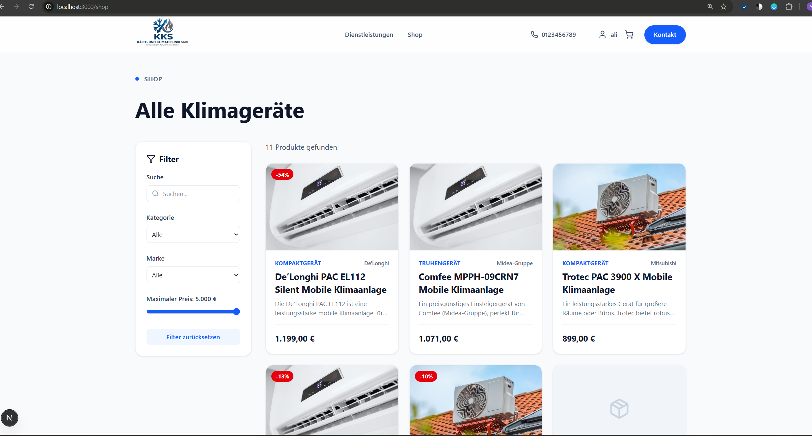](docs/screenshots/shop.png) |
| Landing page hero + sections | Product listing with categories |

| Services `/services` | Contact `/contact` |
| :---: | :---: |
| [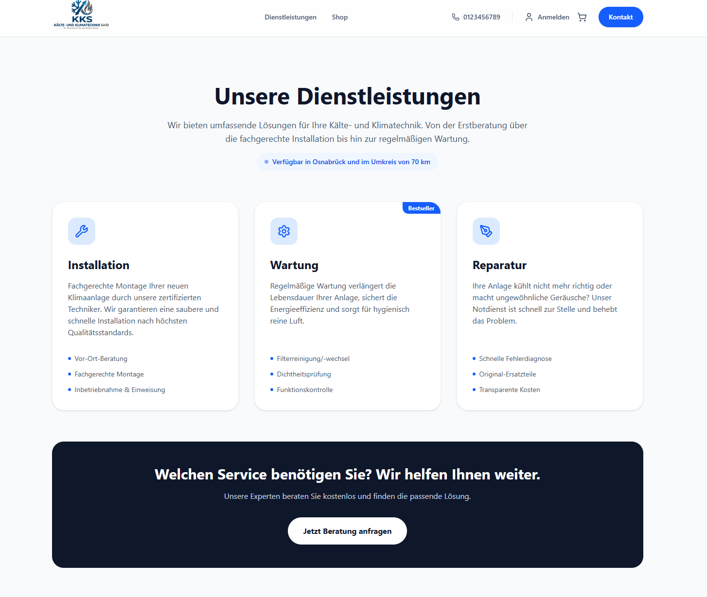](docs/screenshots/services.png) | [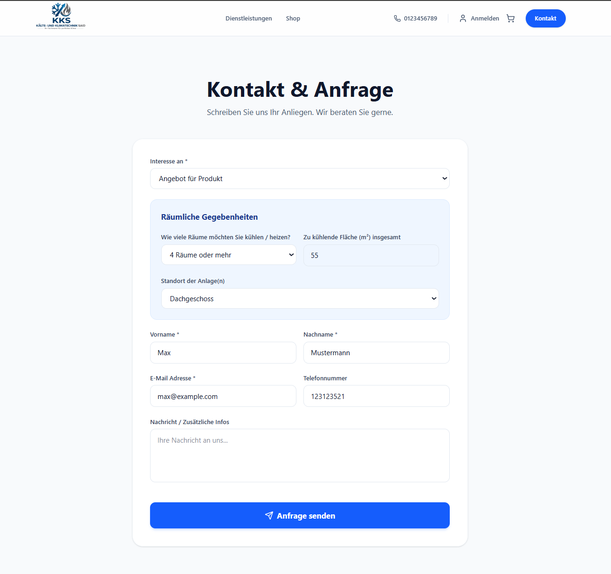](docs/screenshots/contact.png) |
| Field-service offerings + booking entry | Contact form (rate-limited, validated) |

| Shopping cart `/cart` | Customer account `/account` |
| :---: | :---: |
| [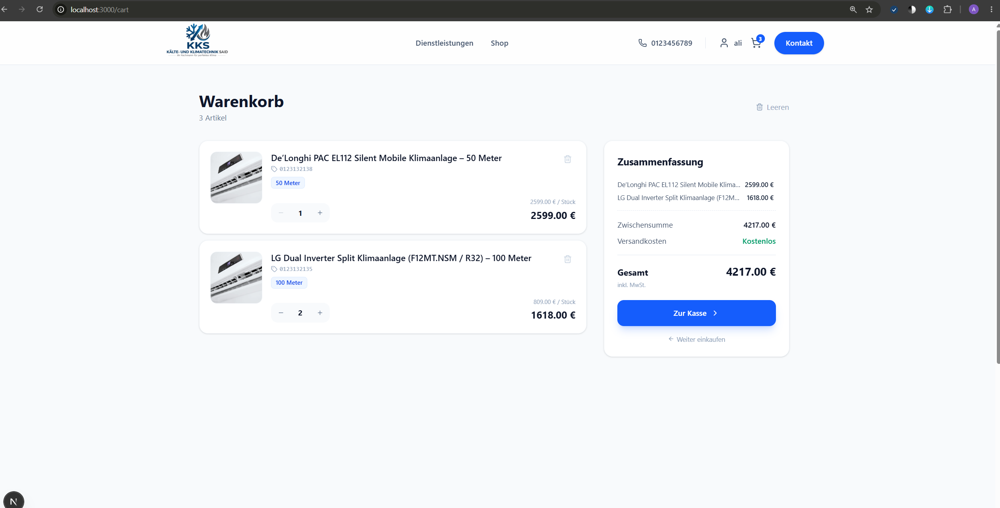](docs/screenshots/cart.png) | [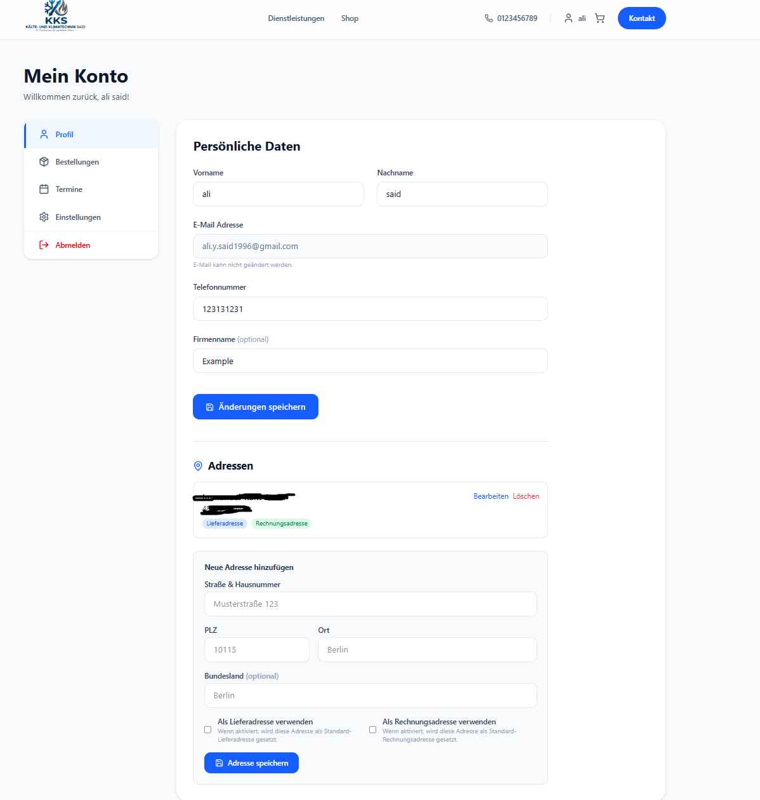](docs/screenshots/account.png) |
| Stateless cart with line items | Auth, saved addresses & order history |

### 🧾 Checkout & Order Output

| Stripe Checkout | Order confirmation | PDF invoice |
| :---: | :---: | :---: |
| [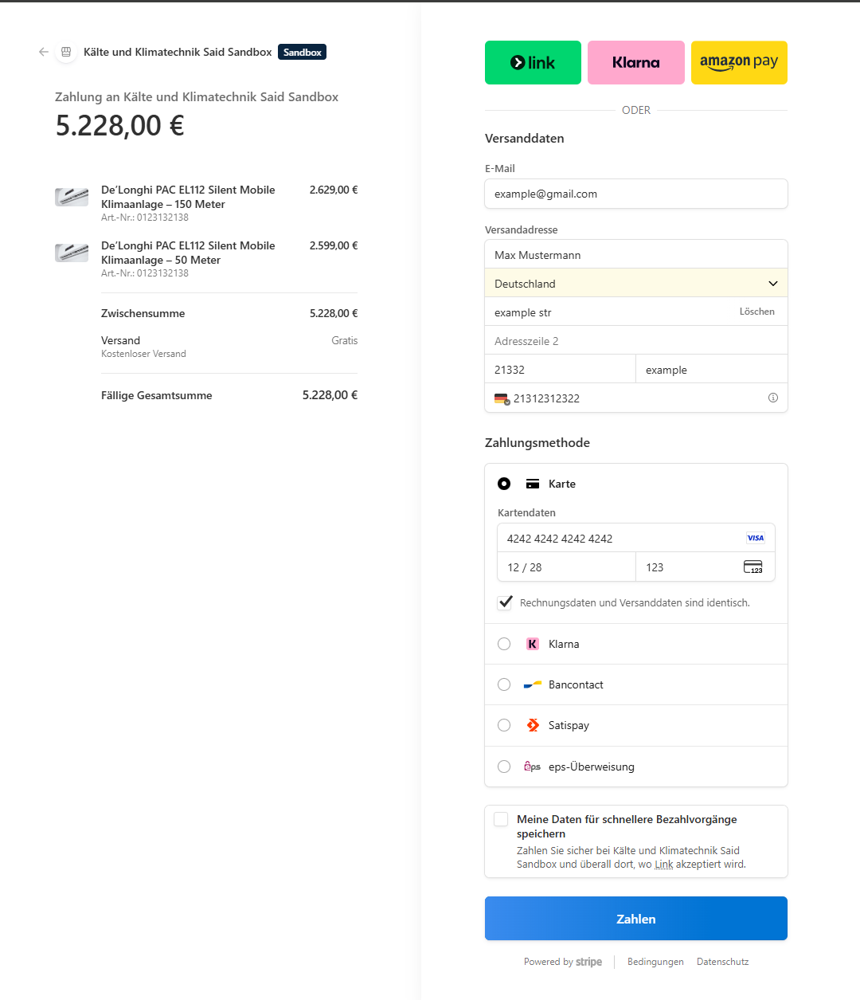](docs/screenshots/checkout.png) | [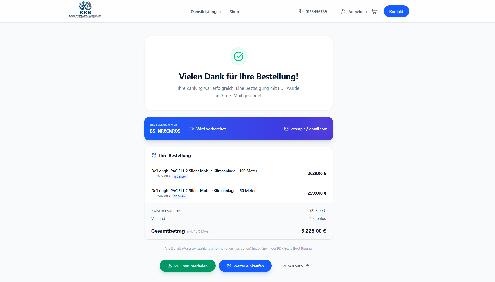](docs/screenshots/checkout-success.png) | [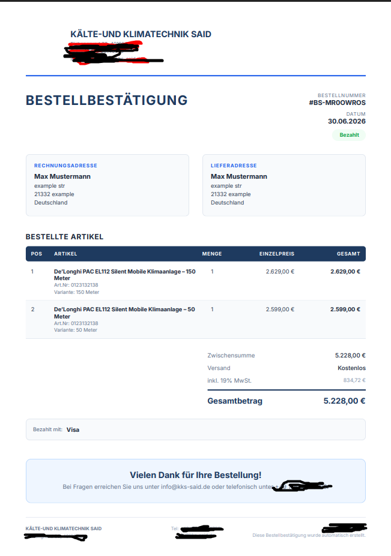](docs/screenshots/invoice.png) |
| Stripe-hosted, server-validated payment | Payment-verified success page | Generated `@react-pdf/renderer` invoice |

### 🛠️ Admin Dashboard / CMS

| Admin dashboard `/admin` | Product editor `/admin/products/[id]` |
| :---: | :---: |
| [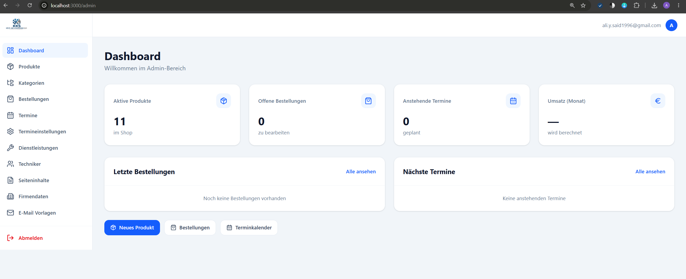](docs/screenshots/admin-dashboard.png) | [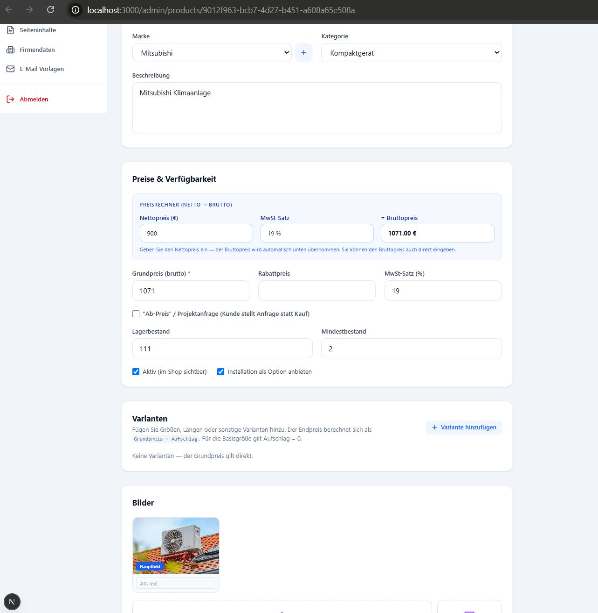](docs/screenshots/admin-product.png) |
| KPI overview (orders, bookings, revenue) | Product CRUD + image upload + rich-text specs |

| Order detail `/admin/orders/[id]` | Email templates `/admin/email-templates` |
| :---: | :---: |
| [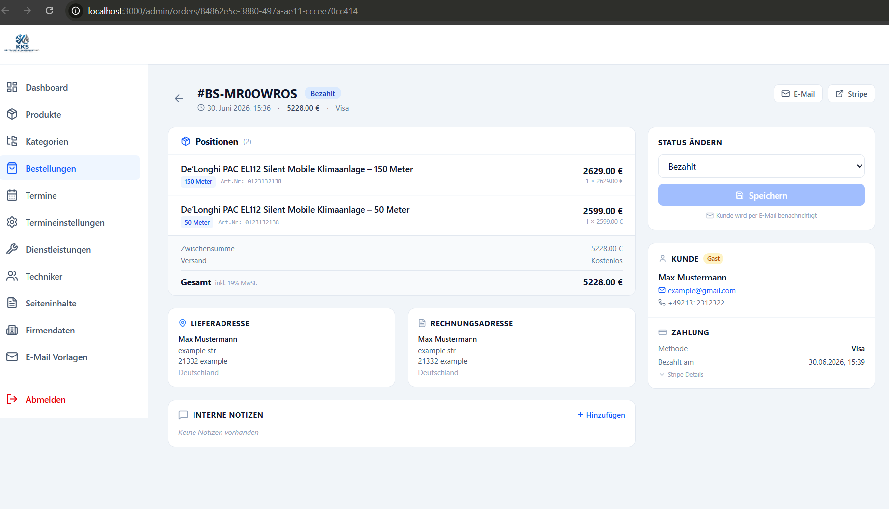](docs/screenshots/admin-order-informations.png) | [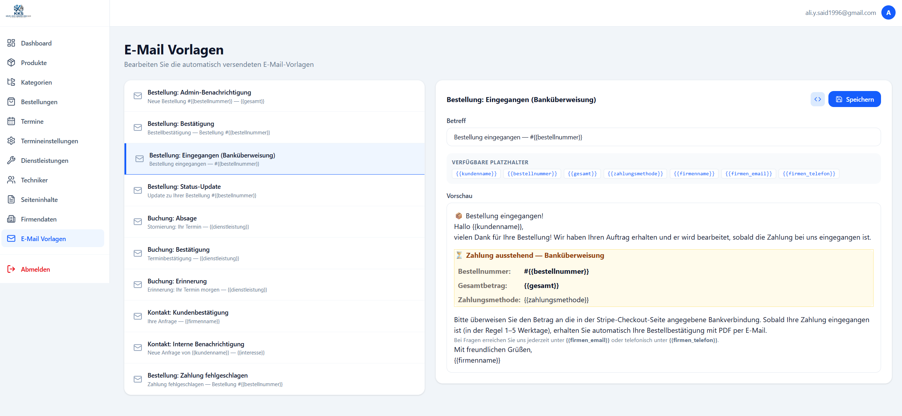](docs/screenshots/email-templates.png) |
| Order info + status workflow + invoice | Editable transactional templates w/ variables |

| Booking calendar `/admin/bookings` | Content CMS `/admin/content/[slug]` |
| :---: | :---: |
| [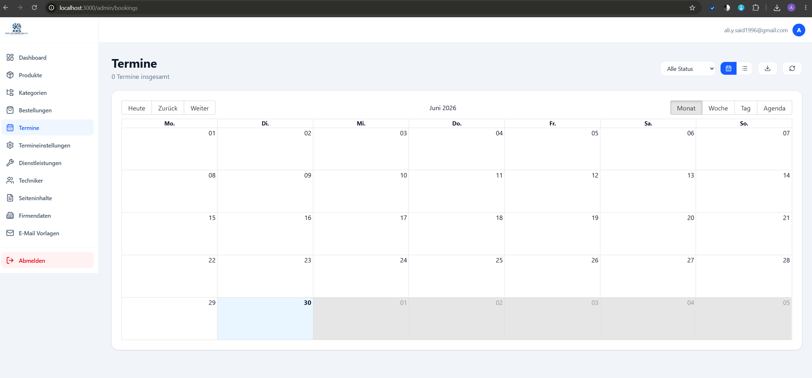](docs/screenshots/admin-calender.png) | [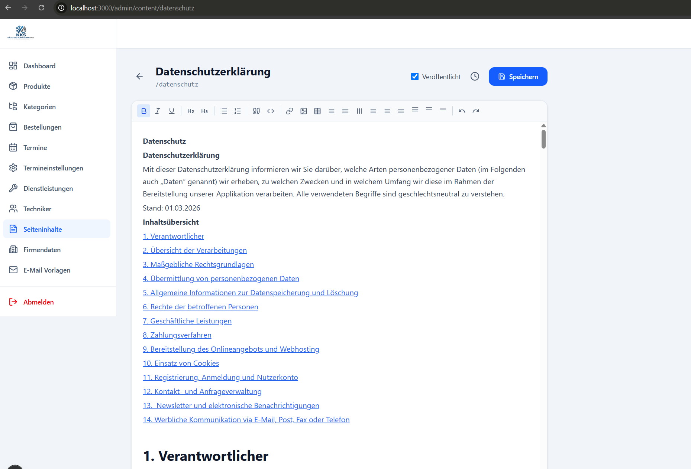](docs/screenshots/admin-cms.png) |
| Technician scheduling + availability | Rich-text editor with version history |

---

## ✨ Features

| Public site | Admin dashboard |
| --- | --- |
| Product catalog + detail pages | KPI overview (orders, bookings, revenue) |
| Configurable price variants (JSONB) | Product CRUD + image upload + rich-text specs |
| Cart + Stripe Checkout | Order management + status workflow + CSV/PDF |
| PDF invoices + email confirmations | Booking calendar + technician scheduling |
| Service booking flow | Content CMS with version history |
| Customer accounts (auth, addresses) | Email-template editor |
| Dynamic legal/CMS pages | Company settings + live theming |

---

## 🧱 Tech Stack

- **Framework:** Next.js 15 (App Router, React Server Components), React 19, TypeScript (strict)
- **Styling:** Tailwind CSS v4, Motion
- **Backend:** Supabase (PostgreSQL + Auth + Storage) with Row Level Security
- **Payments:** Stripe Checkout + webhooks
- **Email:** Resend · **PDF:** @react-pdf/renderer · **Editor:** Tiptap · **Calendar:** react-big-calendar
- **Validation:** react-hook-form + Zod · **Rate limiting:** Upstash Redis
- **Hosting:** Vercel (serverless + cron) · **Testing:** Playwright (E2E)

---

## 🏗️ Architecture

```
                         ┌──────────────── Vercel ─────────────────┐
   Public Site (RSC/SSR) │  Admin /admin (protected)   API /api/*  │
                         │            └── middleware.ts ──┘        │
                         │      (auth guard + rate limiting)       │
                         └────────┬──────────┬──────────┬──────────┘
                                  │          │          │
                            Supabase      Stripe      Resend
                         Postgres/Auth   Checkout    (Emails)
                            /Storage     Webhooks
```

- **Server Components by default**; mutations isolated in `/api` route handlers.
- **Three Supabase clients** (browser / server / service-role) with explicit trust boundaries.
- **Defense in depth:** PostgreSQL RLS *plus* application-level `requireAdmin` / `requireAuth` guards.
- **Stateless cart** in `localStorage`; the order of record is created only after a verified payment.

---

## 🔒 Security

Security was treated as a **first-class, audited workstream**. A formal audit
([`docs/security/SECURITY_AUDIT.md`](docs/security/SECURITY_AUDIT.md)) covered every route,
middleware and script and resolved **28 findings**, including:

- IDOR & broken access control → session-derived identity + admin-role enforcement
- Price manipulation → server-side price fetch + Stripe idempotency
- XSS → allowlist HTML sanitization · CSRF → `SameSite`/`Secure`/`httpOnly` cookies
- Secret hygiene, security headers (CSP/HSTS), verified Stripe webhooks

Reusable modules: `lib/rate-limit.ts`, `lib/sanitize.ts`, `lib/auth-guard.ts`, `lib/api-response.ts`.

---

## 🧪 Testing & CI

Quality is enforced by an automated **[Playwright](https://playwright.dev/)** end-to-end
suite. **CI (Continuous Integration)** means that on **every push and pull request**,
GitHub Actions automatically seeds an isolated test database, builds the app, and runs
the entire test suite — so regressions are caught *before* they can reach production.

| | |
| --- | --- |
| **Tests** | **77 end-to-end tests** across **15 spec files** |
| **Runner** | Playwright (`@playwright/test`) — Chromium in CI, full browser matrix locally |
| **Scope** | Stripe Checkout **+ signed webhooks**, checkout **pricing integrity** & input validation, auth, admin back-office, catalog, cart, bookings, contact, public smoke |
| **Pipeline** | [`.github/workflows/e2e.yml`](.github/workflows/e2e.yml) — seed test DB → build → run suite → upload HTML report (runs on every push/PR to `main` & `develop`) |
| **Test DB** | A **dedicated, isolated Supabase project**, reset & re-seeded deterministically on every run (never touches production) |

Tests are organized by **business criticality** — 🔴 critical (payments, security),
🟠 high (auth, catalog, cart, bookings, contact), 🟡 medium (public smoke). The payment
path is the most heavily covered: signed Stripe webhook events (success, delayed, failed,
expired, idempotency), server-side price integrity (client-supplied prices are ignored),
shipping thresholds, and request validation.

**📖 Where to find the tests & their documentation:**

| Resource | Location |
| --- | --- |
| ✅ The tests themselves | [`tests/`](tests/) — 15 `*.spec.ts` files |
| 📘 **E2E Testing Guide** | [`docs/tests/E2E_TESTING.md`](docs/tests/E2E_TESTING.md) — every suite explained, criticality map, how to run locally, coverage gaps & a full change log |
| ⚙️ **CI Setup** | [`docs/tests/CI_SETUP.md`](docs/tests/CI_SETUP.md) — what the pipeline does and how the isolated test database is seeded |
| 🔧 Workflow definition | [`.github/workflows/e2e.yml`](.github/workflows/e2e.yml) |

```bash
npm test          # full Playwright suite (all browsers)
npm run test:e2e  # Chromium only, rate-limiting disabled — mirrors CI
npm run e2e       # seed the isolated test DB, then run the suite
```

---

## 🧭 How it was built — Documentation-Driven Agentic Development (DDAD)

This project was developed through a deliberate, documented **AI-agent workflow** in which
versioned Markdown files governed the agent as its *constitution, backlog, source of truth,
and audit log*:

| File | Role |
| --- | --- |
| `INSTRUCTIONS.md` | Conventions, design tokens, coding standards (system prompt) |
| `PLAN.md` | 95-item, 8-phase build checklist with live progress tracking |
| `DB_STRUCTURE.md` | Schema verified against the live database |
| `STRIPE_SKILLS.md` | Scoped domain "skill pack" for Stripe work |
| `SECURITY_AUDIT.md` | Findings → fixes ledger |

**Loop:** Specify → Generate → Track → Audit → Reconcile. The result: consistency at scale,
full auditability, and fast onboarding.

---

## 📚 Documentation

Deeper engineering documentation lives in the **[`docs/`](docs/)** folder — start with the
**[documentation index](docs/INDEX.md)** for a linked map of everything. Highlights:

| Document | What's inside |
| --- | --- |
| [`docs/DB_STRUCTURE.md`](docs/DB_STRUCTURE.md) | Database schema & data model — verified against the live DB |
| [`docs/tests/E2E_TESTING.md`](docs/tests/E2E_TESTING.md) | E2E test suite (77 tests): criticality map, how to run, coverage & change log |
| [`docs/tests/CI_SETUP.md`](docs/tests/CI_SETUP.md) | CI pipeline & isolated test-DB seeding |
| [`docs/security/SECURITY_AUDIT.md`](docs/security/SECURITY_AUDIT.md) | Full security audit: 28 findings → fixes |
| [`docs/STRIPE_SKILLS.md`](docs/STRIPE_SKILLS.md) | Scoped Stripe domain "skill pack" used during the build |
| [`docs/plans/`](docs/plans/) | Feature design docs / RFCs (checkout, invoices, email branding, deployment) |
| [`docs/screenshots/`](docs/screenshots/) | The screenshots shown above |
| [`docs/archive/`](docs/archive/) | Historic AI-workflow specs (`INSTRUCTIONS.md`, `PLAN.md`) kept for provenance |

> For the architecture, data model and end-to-end technical write-up, see
> [`ARCHITECTURE_AND_TECHNICAL_OVERVIEW.md`](ARCHITECTURE_AND_TECHNICAL_OVERVIEW.md).

---

## 🚀 Run locally

```bash
npm install
# add your keys to .env.local (Supabase, Stripe, Resend, APP_URL)
npm run dev
```

| Script | Purpose |
| --- | --- |
| `npm run dev` | Start the dev server |
| `npm run build` / `npm start` | Production build / serve |
| `npm run test` | Playwright E2E tests (full browser matrix) |
| `npm run test:e2e` | E2E on Chromium with rate-limiting disabled (mirrors CI) |
| `npm run e2e` | Seed the isolated test DB, then run the suite |
| `npm run migrate` | Apply Supabase migrations |

> 🧪 See **[Testing & CI](#-testing--ci)** and the
> **[E2E Testing Guide](docs/tests/E2E_TESTING.md)** for the full suite and how it runs.

---

## 🧠 Challenges & Lessons Learned

> Interview-ready talking points — real trade-offs made during the build.

- **Trusting the database, not the client.** An early version passed prices and identity
  from the browser. I reworked checkout to fetch prices server-side and derive user identity
  from the session, closing price-manipulation and IDOR gaps. **Lesson:** the client is never
  a source of truth.
- **Schema drift between migrations and reality.** Migration files didn't always match the
  live database. I made `DB_STRUCTURE.md` a source of truth verified directly against the
  running DB. **Lesson:** documentation is only useful if it reflects reality — verify, don't assume.
- **AI speed vs. AI safety.** AI-generated code shipped features fast but introduced subtle
  security gaps. A dedicated, documented audit (28 findings) restored confidence. **Lesson:**
  AI handles the *generation*; a human-owned audit must own the *trust boundaries*.
- **Defense in depth over single guards.** Relying only on RLS *or* only on app checks was
  fragile. Combining Postgres RLS with app-level `requireAdmin`/`requireAuth` guards gave
  layered protection. **Lesson:** assume any single layer can fail.
- **Right-sizing complexity.** I deliberately dropped server-side cart tables in favor of a
  `localStorage` cart + payment-verified orders. **Lesson:** removing unneeded features is a
  feature — less surface area, fewer bugs, less to secure.
- **Serverless realities.** An in-memory rate limiter reset on cold starts, so I moved to
  Upstash Redis with an in-memory dev fallback. **Lesson:** design stateful concerns for the
  deployment model, not the dev machine.
- **Specs as the AI's memory.** Ad-hoc prompting produced inconsistent code; versioned
  Markdown specs (constitution, plan, skills) kept dozens of routes consistent. **Lesson:**
  durable written context beats clever one-off prompts.

---

## 🔭 Possible Next Steps

- Nonce-based CSP to remove `'unsafe-inline'`/`'unsafe-eval'` in production.
- Role granularity (e.g. an `editor` role with scoped permissions).
- GDPR consent logging (`einwilligungen`) if marketing emails are added.
- Booking happy-path E2E coverage + visual-regression tests (checkout, pricing & webhooks are already covered).

---

<div align="center">

Built by **Ali Said** · Next.js 15 · React 19 · TypeScript · Supabase · Stripe · Resend · Vercel

</div>

